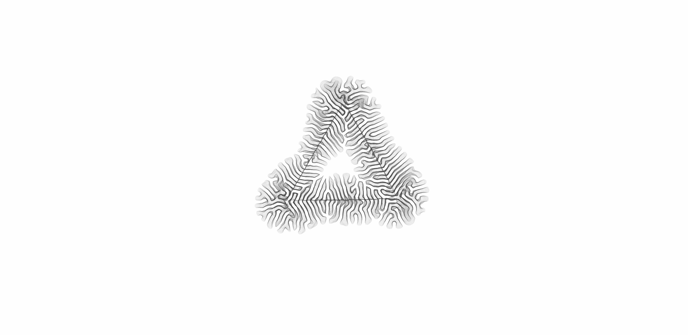
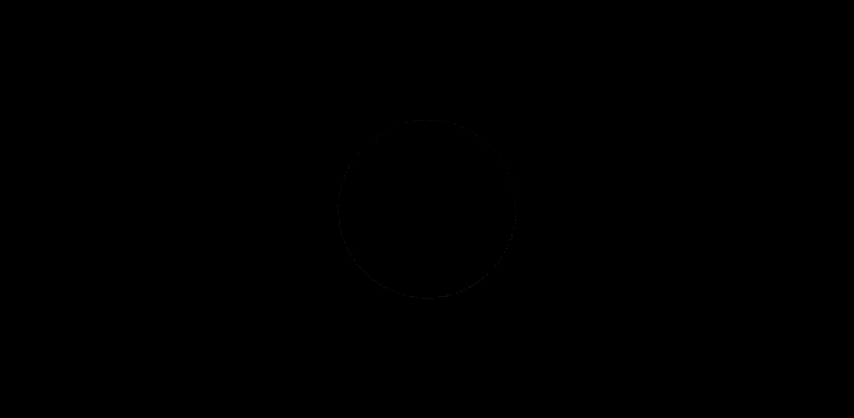
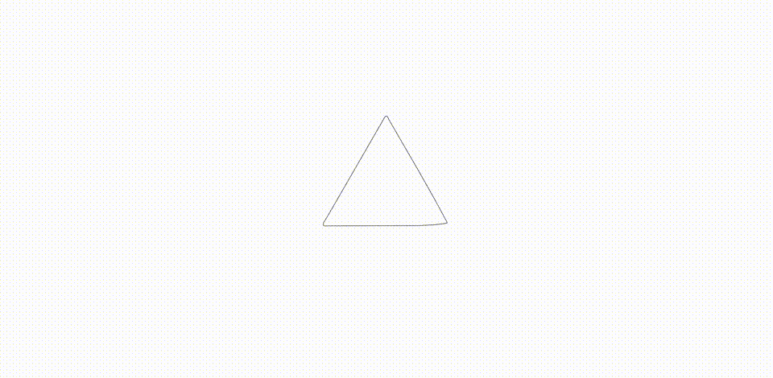

# 02 - simple closed shape

This experiment applies the differential growth process to a single closed path.

# Keyboard commands

| Key     | Result                                 |
| ------- | -------------------------------------- |
| `1`-`3` | Change initial seed path shape         |
| `t`     | Toggle "trace mode"                    |
| `n`     | Toggle visibility of nodes             |
| `r`     | Reset simulation with same parameters  |
| `Space` | Pause or unpause the simulation        |
| `i`     | Toggle inverting of colors             |
| `d`     | Toggle "debug mode"                    |
| `f`     | Toggle shape fills                     |

# Samples

