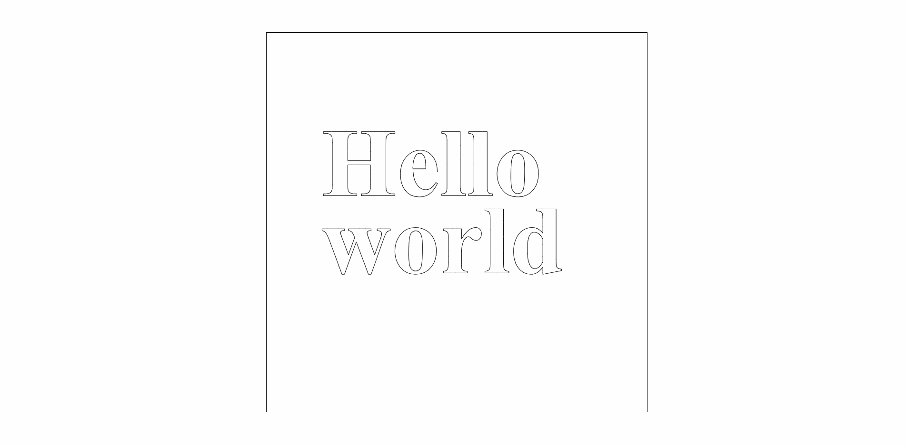
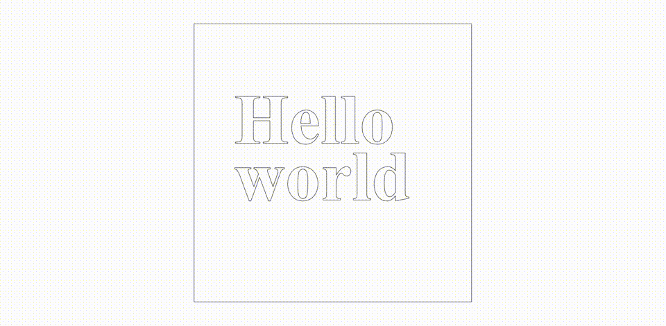

# 04 - SVG as input

This experiment applies the differential growth process to paths that are brought in through an external SVG file.

# Preparing SVGs for input

- Set up Inkscape to [use absolute coordinates](http://www.inkscapeforum.com/viewtopic.php?t=11228) for SVGs.
- Convert all objects to paths by selecting everything and using **Path > Object to Path**.
- *(Optional)* Ungroup all paths fro simplicity by selecting everything and using **Object > Ungroup**.
- Convert all segments to lines by using the **Edit paths by node** tool to select all nodes in all paths and clicking the icon for **Make selected segments lines**.
- Resize canvas to fit content by going to the Document Properties, expanding the section for _Resize page to content..._ under _Custom size_ and click the **Resize page to drawing or selection** button.
- Save as an SVG.

# Samples

